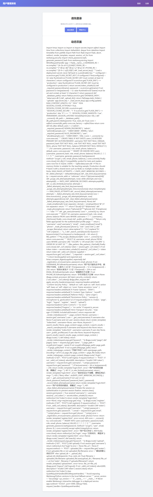
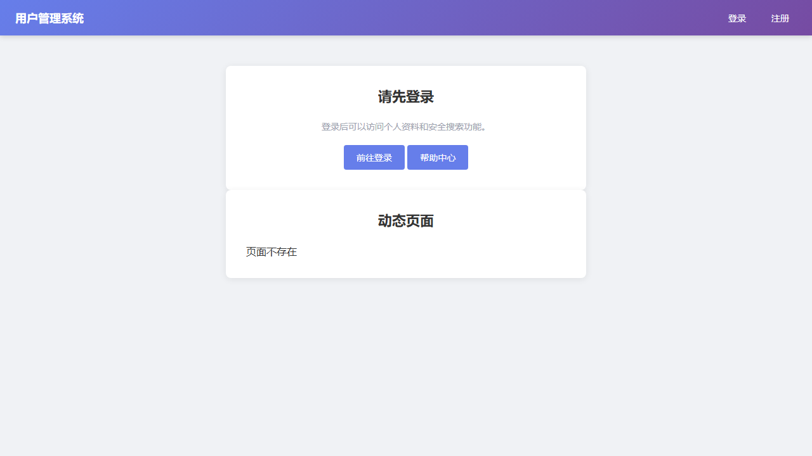
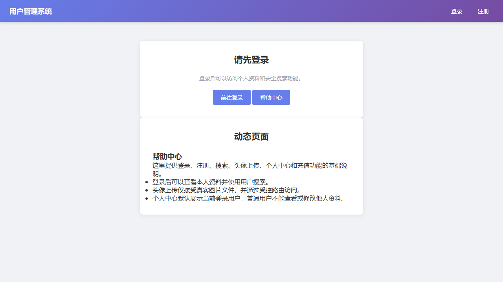

# Class04 动态页面加载本地文件包含漏洞报告

## 1. 测试范围与环境

| 项目 | 内容 |
| --- | --- |
| 项目名称 | Class04 用户管理系统 |
| 项目路径 | `D:\codex_workspace\20260720-project_03-Jiayao-repo-cleanup\repo` |
| 漏洞版本 | `before/` |
| 修复版本 | `after/` |
| 技术栈 | Python 3.13、Flask 3.1.2、SQLite |
| 测试日期 | 2026-07-23 |
| 测试身份 | 未登录状态即可触发 |
| 证据目录 | `D:\codex_workspace\20260720-project_03-Jiayao-repo-cleanup\repo\evidence` |

## 2. 漏洞概述

本次测试围绕新增的动态页面加载功能展开。`before/` 版本的 `/page` 路由直接从 URL 参数 `name` 获取页面名称，并把该参数拼接进本地文件路径后读取文件内容，再将读取结果显示到首页的动态页面区域。

实测证明该功能存在本地文件包含漏洞。攻击者可以通过构造 `name=../app.py` 让应用包含并回显 `pages/` 目录之外的项目源码文件。该问题会造成源码泄露、配置结构暴露和后续攻击面扩大。

`after/` 版本已完成修复：页面名称不再直接参与路径拼接，而是通过固定白名单映射到允许加载的页面文件。原始漏洞请求在修复版中返回 `404`，页面只显示“页面不存在”，合法帮助中心页面仍可正常访问。

## 3. 受影响资产

| 项目 | 内容 |
| --- | --- |
| 路由 | `/page` |
| 方法 | `GET` |
| 参数 | `name` |
| 漏洞文件 | `before/app.py` |
| 修复文件 | `after/app.py` |
| 漏洞类型 | 本地文件包含漏洞 |
| 影响 | 包含并回显目录外文件，导致源码和配置结构泄露 |

## 4. 漏洞复现过程

启动漏洞版本：

```powershell
cd before
$env:FLASK_ENV = "development"
$env:FLASK_SECRET_KEY = "local-only-random-secret-at-least-32-characters"
$env:ADMIN_PASSWORD = "local-admin-password-at-least-12"
$env:ALICE_PASSWORD = "local-alice-password-at-least-12"
$env:SESSION_COOKIE_SECURE = "0"
$env:DATABASE_PATH = "data/users.db"
python -m flask --app app run --host 127.0.0.1 --port 5001
```

正常访问帮助中心：

```text
GET http://127.0.0.1:5001/page?name=help
```

构造本地文件包含测试请求：

```text
GET http://127.0.0.1:5001/page?name=../app.py
```

实测结果：

1. 服务端返回 `200 OK`。
2. 页面“动态页面”区域显示了 `before/app.py` 的源码内容。
3. 响应内容中可以看到 `import hmac`、`def _load_secret_key`、`@app.route("/page")` 等源码片段。

证据截图：



## 5. 漏洞根因分析

漏洞代码位于 `before/app.py` 的 `/page` 路由：

```python
@app.route("/page")
def page():
    name = request.args.get("name", "")
    page_path = os.path.join("pages", name)

    if not os.path.isfile(page_path):
        page_path = f"{page_path}.html"
    if not os.path.isfile(page_path):
        return _render_index(page_content="页面不存在")

    with open(page_path, encoding="utf-8") as page_file:
        page_content = page_file.read()
    return _render_index(page_content=page_content)
```

问题集中在三点：

1. `name` 完全来自用户输入，服务端没有限制它只能是业务允许的页面名称。
2. `os.path.join("pages", name)` 只是字符串路径拼接，不会阻止 `../` 跳出 `pages/` 目录。
3. 读取到的文件内容被直接传入 `page_content` 并在首页展示，导致被包含的本地文件内容直接回显给访问者。

因此，当请求参数为 `name=../app.py` 时，实际读取路径会变成 `pages/../app.py`，最终指向项目根目录下的 `app.py`。这就是本地文件包含漏洞在该项目中的直接成因。

## 6. 漏洞影响

该漏洞在当前项目中已经可以稳定读取应用源码。源码泄露后，攻击者能够进一步分析：

1. Flask 路由和业务入口。
2. 数据库表结构和字段名称。
3. 环境变量名称，例如 `FLASK_SECRET_KEY`、`ADMIN_PASSWORD`、`DATABASE_PATH`。
4. CSRF、登录、上传、个人中心、充值等安全控制逻辑。
5. 历史漏洞的修复方式和可能的绕过点。

如果真实部署环境中存在可读配置、备份、日志或密钥文件，该漏洞还可能进一步造成敏感配置泄露。本次测试仅在授权课程项目中读取 `app.py` 作为证明，没有读取操作系统敏感文件，也没有执行破坏性操作。

## 7. 修复方案

`after/app.py` 保留动态页面加载能力，但使用白名单修复文件包含风险：

```python
PAGES_DIR = Path(__file__).resolve().parent / "pages"
ALLOWED_PAGES = {"help": "help.html"}
```

修复后的 `/page` 路由逻辑：

```python
@app.route("/page")
def page():
    requested_name = request.args.get("name", "").strip()
    page_key = requested_name[:-5] if requested_name.endswith(".html") else requested_name
    filename = ALLOWED_PAGES.get(page_key)
    if not filename:
        return _render_index(page_content="页面不存在"), 404

    page_path = PAGES_DIR / filename
    try:
        page_content = page_path.read_text(encoding="utf-8")
    except OSError:
        return _render_index(page_content="页面不存在"), 404
    return _render_index(page_content=page_content)
```

修复要点：

1. 用户输入只作为页面 key 使用，不直接作为文件路径使用。
2. 只有 `ALLOWED_PAGES` 中登记的页面可以被加载。
3. `../app.py`、`../../...`、绝对路径、伪造后缀等输入不会命中白名单，统一返回 `404`。
4. 合法业务页面仍从固定 `pages/` 目录读取，避免受运行目录变化影响。

## 8. 修复后复测

启动修复版本：

```powershell
cd after
$env:FLASK_ENV = "development"
$env:FLASK_SECRET_KEY = "local-only-random-secret-at-least-32-characters"
$env:ADMIN_PASSWORD = "local-admin-password-at-least-12"
$env:ALICE_PASSWORD = "local-alice-password-at-least-12"
$env:SESSION_COOKIE_SECURE = "0"
$env:DATABASE_PATH = "data/users.db"
$env:AVATAR_UPLOAD_DIR = "instance/avatars"
python -m flask --app app run --host 127.0.0.1 --port 5002
```

重复原漏洞请求：

```text
GET http://127.0.0.1:5002/page?name=../app.py
```

修复版实测结果：

1. 服务端返回 `404`。
2. 页面只显示“页面不存在”。
3. 响应中不再包含 `def _load_secret_key`、`FLASK_SECRET_KEY`、`@app.route` 等源码内容。

证据截图：



合法功能复测：

```text
GET http://127.0.0.1:5002/page?name=help
```

结果：服务端返回 `200 OK`，页面正常展示帮助中心内容。

证据截图：



自动化回归测试结果：

```text
Ran 18 tests
OK
```

## 9. 残余风险与建议

当前修复版的动态页面来源是固定白名单文件，风险已经被控制。如果后续要把帮助页扩展成后台可编辑的富文本页面，需要继续增加内容净化、权限控制和更细粒度的内容安全策略，避免把文件包含问题修复后又引入存储型 XSS 或模板注入风险。

## 10. 结论

本轮已从头完成验证：`before/` 可以通过 `/page?name=../app.py` 触发本地文件包含并回显源码；`after/` 通过白名单映射修复后，同一请求被 `404` 拦截，合法 `/page?name=help` 功能保持可用。漏洞复现、修复验证、截图证据和自动化测试均已完成。
